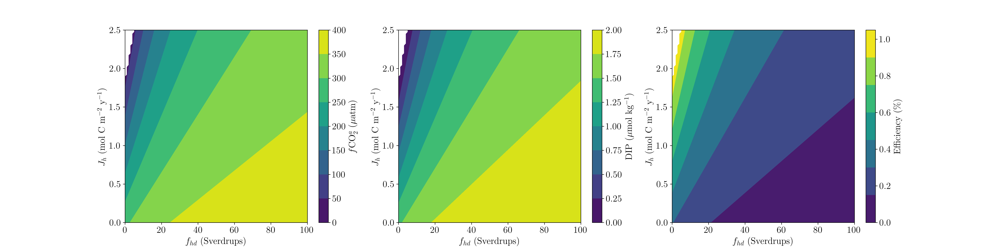

# Description
In this repository, I present a simple coupled steady-state, ocean-atmosphere 4-box model. It is of a Sarmiento and Toggweiler-type (1984) that can be used to understand the qualitative feedbacks between the ocean and atmosphere systems. Example output is presented below:



# Model Equations
I present the simple model equations in this section, which are modified from Emerson and Hamme (2022). We start with the phosphate equations:
```math
\begin{align}
  V_h \frac{\partial P_h}{\partial t} &= T(P_l - P_h) + f_{hd}(P_d - P_h) - J_hS_h, \\
  V_l \frac{\partial P_l}{\partial t} &= T(P_d - P_l) - J_lS_l.
\end{align}
```
Now I present the alkalinity equations ::
```math
\begin{align}
  V_h \frac{\partial A_h}{\partial t} &= T(A_l - A_h) + f_{hd}(P_d - P_h) - J_hS_hr_{a:p}, \\
  V_l \frac{\partial A_l}{\partial t} &= T(P_d - P_l) - J_lS_lr_{a:p}, \\
  \Sigma A &= V_lA_l + V_dA_d + V_hA_h.
\end{align}
```
Next I cover the equations for DIC ::
```math
\begin{align}
  V_h \frac{\partial C_h}{\partial t} &= T(C_l - C_h) + f_{hd}(C_d - C_h) - J_hS_hr_{c:p} + kK_{H,h}S_h(f\text{CO}_2^a - f\text{CO}_2^h), \\
  V_l \frac{\partial C_l}{\partial t} &= T(C_d - C_l) - J_lS_lr_{c:p} + kK_{H,l}S_l(f\text{CO}_2^a - f\text{CO}_2^l), \\
  V_a \frac{\partial C_a}{\partial t} &= kK_{H,h}S_h(f\text{CO}_2^a - f\text{CO}_2^h) + kK_{H,l}S_l(f\text{CO}_2^a - f\text{CO}_2^l), \\
  \Sigma C &= V_lC_l + V_dC_d + V_hC_h + M_a\cdot f\text{CO}_2^a.
\end{align}
```
We continue to follow Emerson and Hamme (2022) and linearize the relationship between $A, C$, and $f\text{CO}_2^{sw}$:
```math
\begin{align}
  (A_h - C_h) &= \beta_hf\text{CO}_2^h + \gamma_h, \\
  (A_l - C_l) &= \beta_lf\text{CO}_2^l + \gamma_l. \\
\end{align}
```
# Model Formulation
We assume steady-state, instead of using an interative solver as is done by Sarmiento and Toggweiler (1984), which allows us to set the LHS of the above equations to 0 and solve for our concentrations in each box. This allows for a simulataneously solution of matrices of the form:
```math
Ax=b
```
which has the solution, assuming that $A$ is invertible, of the form:
```math
x^\ast = A^{-1}b.
```
Therefore, we have the following set of matrix equations, starting with those for phosphate, which are modified from those presented in Emerson and Hamme (2022) to let the concentrations in the high and low latitude boxes be the unknowns that are determined through inversion:
```math
x^\ast_P =
\begin{bmatrix}
-f_{hd} - T & T \\
0 & -T
\end{bmatrix}^{-1}
\begin{bmatrix}
J_hS_h \\
J_lS_l
\end{bmatrix}
```
Now, I present the alkalinity equation solved within the model at steady-state:
```math
x^\ast_A =
\begin{bmatrix}
-f_{hd} - T & T \\
0 & -T
\end{bmatrix}^{-1}
\begin{bmatrix}
J_hS_hr_{a:p} \\
J_lS_lr_{a:p}
\end{bmatrix}
```
Last, I give the coupled $f\text{CO}_2$ and DIC model matrix equation solved within the model at steady-state:
```math
x^\ast_C =
\begin{bmatrix}
T & (-T - f_{hd}) & f_{hd} & 0 & -kK_{H,h}S_h & kK_{H,h}S_h \\
-T & 0 & T & -kK_{H,l}S_l & 0 & kK_{H,l}S_l \\
0 & 0 & 0 & kK_{H,l}S_l & kK_{H,h}S_h & -k(K_{H,h}S_h + K_{H,l}S_l) \\
V_l & V_h & V_d & 0 & 0 & M_a \\
10^{15} & 0 & 0 & \beta_l10^{15} & 0 & 0 \\
0 & 10^{15} & 0 & 0 & \beta_h10^{15} & 0 
\end{bmatrix}^{-1}
\begin{bmatrix}
J_hS_hr_{c:p} \\
J_lS_lr_{c:p} \\
0 \\
\Sigma C \\
(A_l - \gamma_l)\times10^{15} \\
(A_h - \gamma_h)\times10^{15}
\end{bmatrix}
```
# Using the model
You can find an example of how to run the model in `example_FourBox.py`. The model class is in `FourBox.py`, which has all of the model equations and solution set-up, for which we use the simple `numpy.linalg.solve()` function.

# References
[1] Emerson and Hamme (2022): Chemical Oceanography: Element Fluxes in the Sea.

[2] Sarmiento and Toggweiller (1984): A new model for the role of the oceans in determining atmospheric $p\text{CO}_2$.
